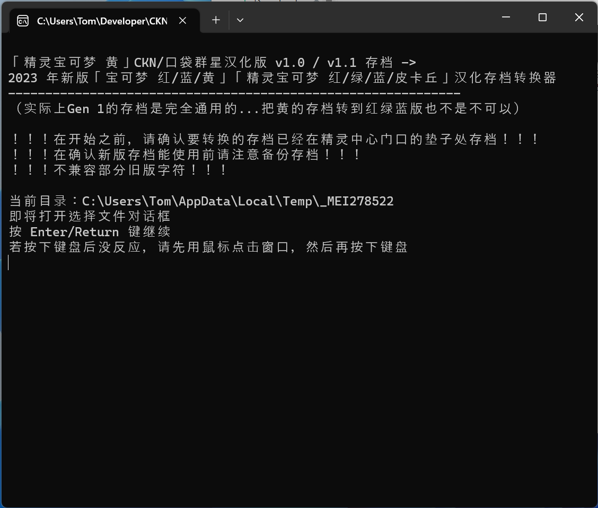
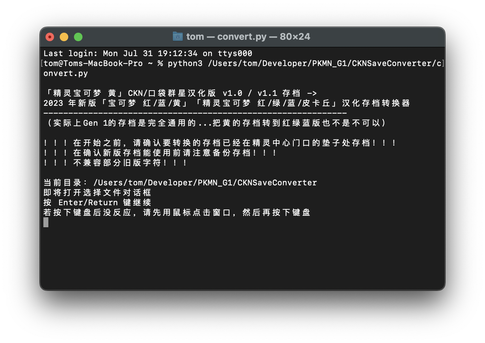

# 「精灵宝可梦 黄」CKN/口袋群星汉化版 v1.0 / v1.1 存档 -> 2023 年新版「宝可梦 红/蓝/黄」「精灵宝可梦 红/绿/蓝/皮卡丘」汉化存档转换器

## 概览

- 【1】关于要迁移的存档的游戏 [「CKN&口袋群星SP《精灵宝可梦 皮卡丘》汉化版V1.1」](https://www.bilibili.com/read/cv8590363/)
- 【2】关于新版本汉化 [「宝可梦 红/蓝、精灵宝可梦 红/绿/蓝 2023新版汉化」](https://github.com/TomJinW/pokeredCHS)、[「宝可梦 黄、精灵宝可梦 皮卡丘 2023新版汉化」](https://github.com/TomJinW/pokeyellowCHS)。
- 本工具会转换【1】中生成的存档，供【2】使用。
- 由于「精灵宝可梦 黄」CKN/口袋群星汉化版 v1.0 / v1.1 内部使用标准 GB2312 编码，将该版本存档迁移存档到新版汉化版会因为内部编码不通用导致名称乱码。故开发此工具，可以把过去的存档转换成新版游戏用编码。
	-  2023 年新版「宝可梦 红/蓝/黄」「精灵宝可梦 红/绿/蓝/皮卡丘」使用和 CKN/口袋群星汉化版「精灵宝可梦·水晶」相同的编码。
	-  「精灵宝可梦 黄」CKN/口袋群星汉化版 v1.1 在联机通信时，游戏内会自动把 GB2312 编码转换成和「精灵宝可梦·水晶」兼容的编码，因此版本间通信交换并无问题。但此方案无法适用于存档迁移。

## 使用方法

- 需要 python3 环境，Windows 用户也可以使用 Release 下的打包好的 .exe 文件（.exe 文件不需要 python 环境）。
	- 直接使用 python3 运行脚本即可，不需要任何额外参数。

- 请先在精灵中心垫子前存档。若在该位置迁移后新存档死机，请携带会飞翔的宝可梦在精灵中心室外门口存档。

- 运行脚本，按提示操作即可。